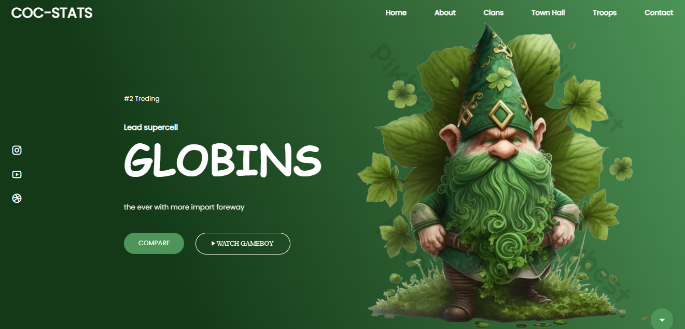

# Aos si


Leprechauns in Ireland are widely known for being magical beings that have given rise to all kinds of legends from their native country of Ireland to the rest of the world.

Furthermore, and with distinction from other legendary characters, there is also talk of their real existence throughout the globe, with total apathy regarding which peoples had resided there before or the theology of the place.

# To download the project

```
downloand project and the links

```

```
    link icon: "https://unpkg.com/boxicons@latest/css/boxicons.min.css">
    link font "https://cdn.jsdelivr.net/npm/remixicon@3.6.0/fonts/remixicon.css" rel="stylesheet">
    <link rel="preconnect" href="https://fonts.googleapis.com">
    <link rel="preconnect" href="https://fonts.gstatic.com" crossorigin>
    <link href="https://fonts.googleapis.com/css2?family=Permanent+Marker&family=Poppins:ital,wght@0,300;0,400;1,500;1,700&display=swap" rel="stylesheet">


```


